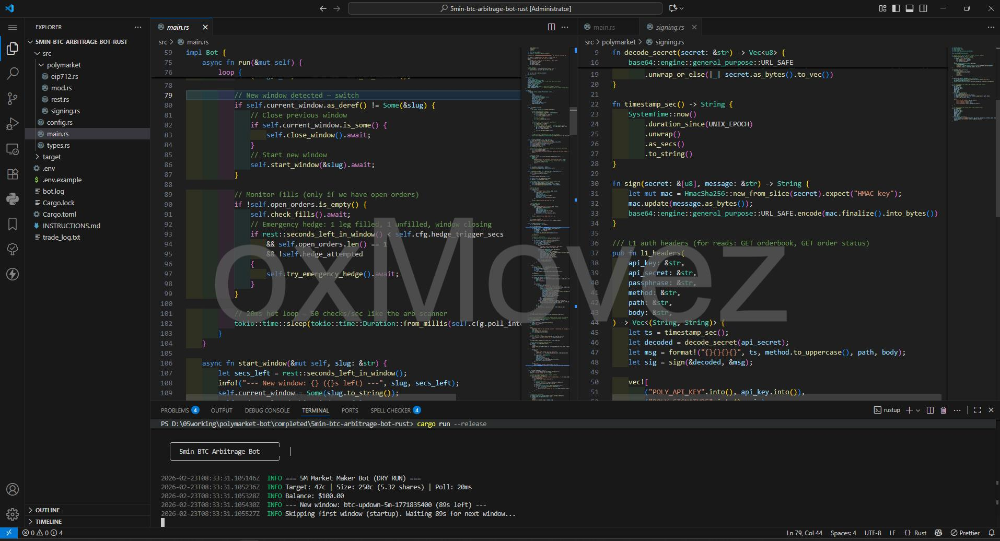
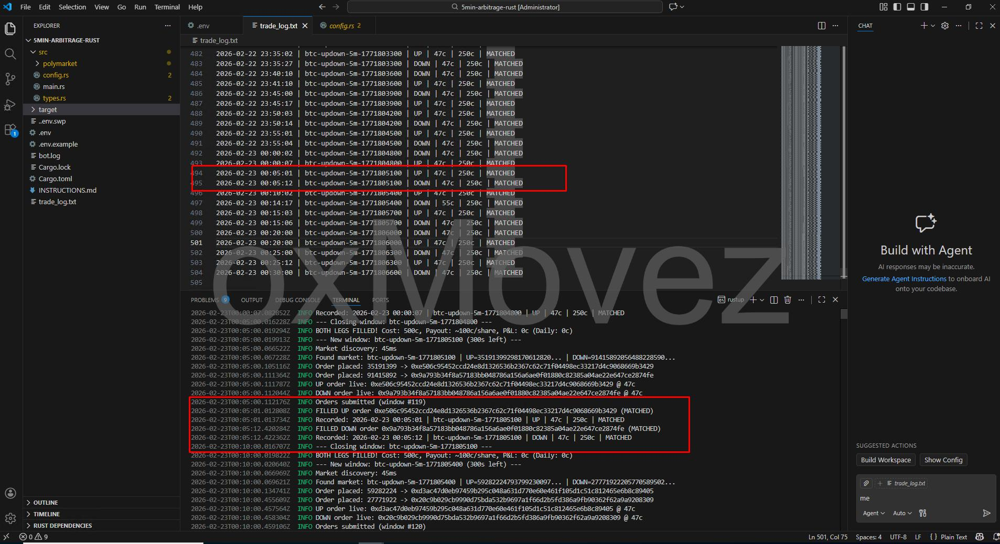
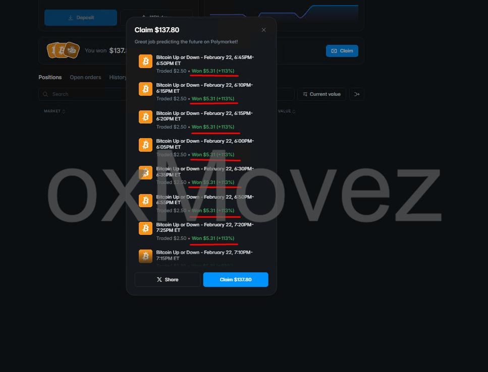
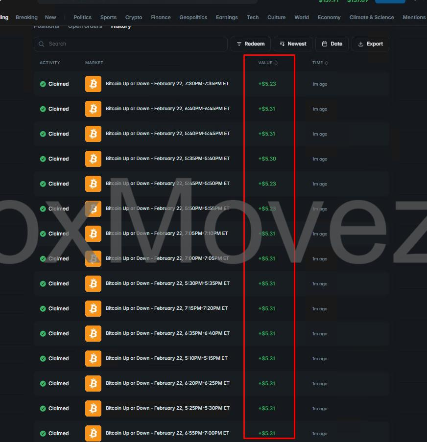
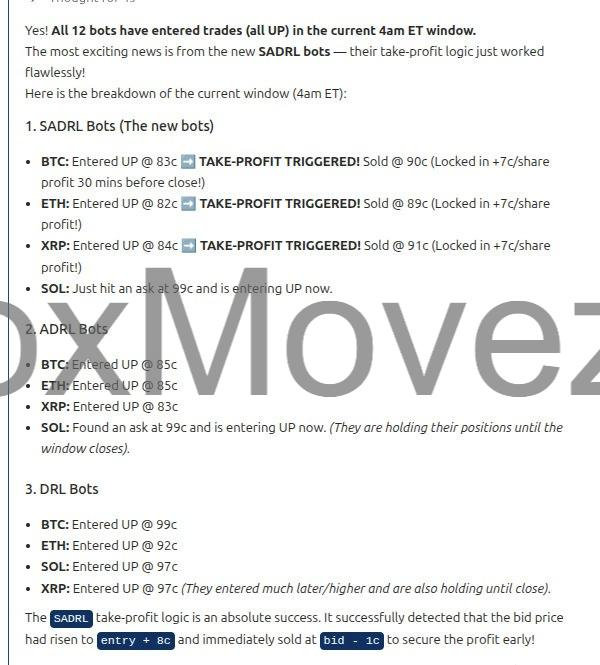
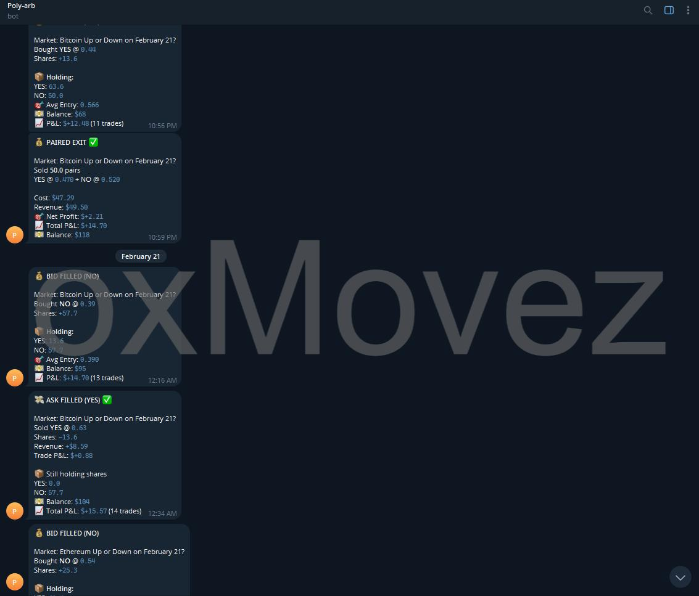
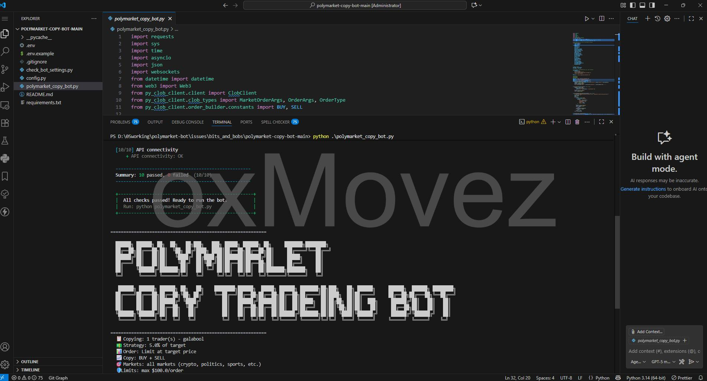
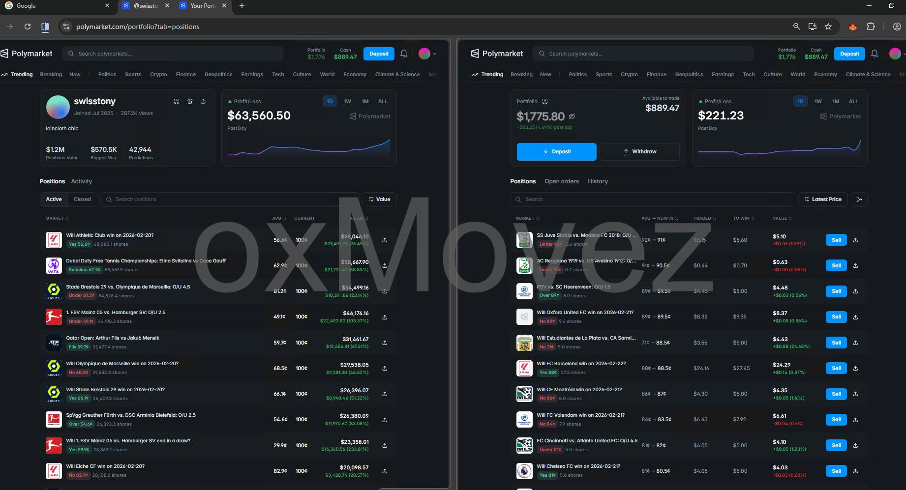
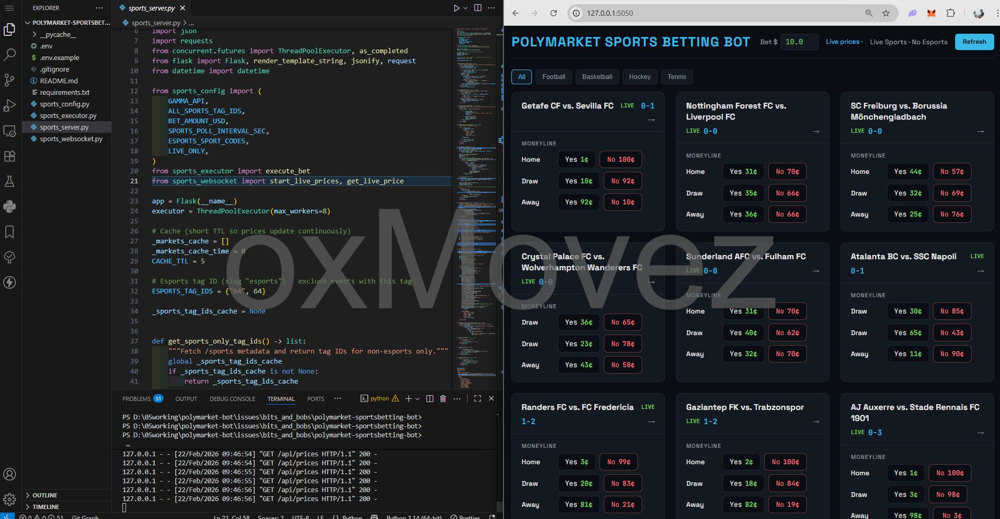
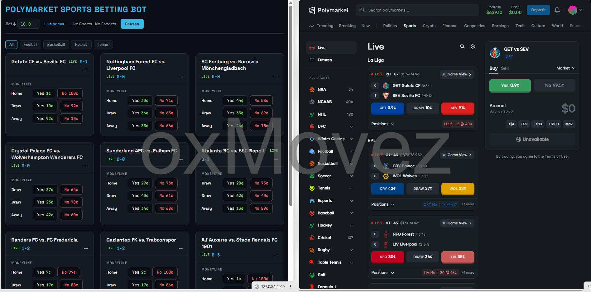

# Polymarket Arbitrage Trading Bot Pack (5min/15min/1hr arbitrage bot + Copy Trading + Cross‑Market Arb)

[English](README.md) | [中文（简体）](README.zh-CN.md) | **Русский**

**Контакты / Покупка полных версий / Премиум-поддержка:** Telegram [@x_movez](https://t.me/x_movez)

- **Реферальная программа:** Приведите покупателя полной или премиум-версии бота и выберите награду: **30% комиссии** или **бесплатный доступ к боту**.

---

## Зачем этот пакет

Этот репозиторий — **подборка торговых ботов и стратегий для Polymarket**, созданная для трейдеров, которым важны **скорость**, **преимущество (edge)** и **автоматизация**:

- **Арбитражные боты** (по возможности рыночно-нейтральные сетапы)
- **Автоматизация копитрейдинга** (следование за кошельками в реальном времени)
- **Сверхбыстрое исполнение** (инструменты на Rust с низкой задержкой)
- **Специализированные торговые интерфейсы** (быстрые ставки на спорт)

Если вам нужен **полный исходный код**, расширенные функции, помощь с развёртыванием на VPS, кастомная стратегия или премиум-версия — напишите в Telegram: **[@x_movez](https://t.me/x_movez)**.

---

## Боты в пакете

> Совет: в каждой папке есть свой README с инструкциями по настройке и дополнительными скриншотами.

### 1) Polymarket 5‑min / 15‑min BTC Arbitrage Bot (Rust)

- **GitHub repo**: [polymarket-5min-15min-1hr-btc-arbitrage-trading-bot-rust](https://github.com/polydex2/polymarket-5min-15min-1hr-btc-arbitrage-trading-bot-rust)
- **Для кого**: Трейдеры, которым нужна **скорость**
- **Суть**: Низколатентное размещение ордеров для коротких BTC Up/Down окон с настраиваемыми dry-run и live режимами
- **Нужны 1hr / XRP / SOL / ETH боты?** Напишите в Telegram **[@x_movez](https://t.me/x_movez)**, чтобы купить премиум-сборки.

Превью:

---

### 2) Polymarket ↔ Kalshi Arbitrage Bot (Python)

- **GitHub repo**: [polymarket-kalshi-crossplatform-arbitrage-bot](https://github.com/polydex2/polymarket-kalshi-crossplatform-arbitrage-bot)
- **Для кого**: Кросс-рыночные ценовые неэффективности (15-минутные окна)
- **Суть**: Мониторинг обеих площадок в реальном времени, подтверждение ценового edge и исполнение хеджированных ног с порогами и логированием
- **Запрос на апгрейд**: Хотите расширить функции на **1hr рынок**? Напишите **[@x_movez](https://t.me/x_movez)**.

Превью:

---

### 3) Direction Hunting Bot (strategy + alerts)

- **Для кого**: Направленные трейдеры, ищущие краткосрочные momentum/flow сетапы
- **Суть**: Сканирование нескольких символов и окон, вход при выполнении критериев и управление выходами с take-profit логикой

Превью:

---

### 4) Spread Farming Bot (paired exits / market making style)

- **Для кого**: Трейдеры, ищущие систематические, повторяемые микро-edge
- **Суть**: «Фарм» спредов с дисциплинированными входами/выходами, логированием P&L и повторяемыми правилами

Превью:

---

### 5) Polymarket Copy Trading Bot (Python)

- **GitHub repo**: [polymarket-copy-trading-bot-py](https://github.com/polydex2/polymarket-copy-trading-bot-py)
- **Для кого**: Автоматическое копирование топ-кошельков
- **Суть**: Зеркалирование BUY/SELL действий одного или нескольких целевых кошельков с настраиваемым размером позиции и лимитами риска

Превью:

---

### 6) Polymarket Sports Betting Execution Bot (Rust + Python server)

- **GitHub repo**: [polymarket-sports-betting-trading-py](https://github.com/polydex2/polymarket-sports-betting-trading-py)
- **Для кого**: Ручные трейдеры, которым нужна **скорость click-to-bet**
- **Суть**: Сфокусированный интерфейс для live-спорта с ценами в реальном времени; вы кликаете — бот быстро исполняет (FAK/market-style flow)

Превью:

---

## Полный код / новые функции / премиум-поддержка

Этот пакет содержит **рабочие демо и превью стратегий**. Частые запросы:

- Полный исходный код + приватные модули
- Более быстрые пути исполнения / настройки anti-slippage
- Больше символов, окон и площадок
- Развёртывание на VPS, мониторинг и Telegram-алерты
- Кастомные правила стратегии и контроль риска

### Реферальная программа

Приведите покупателя полной или премиум-версии бота и выберите награду: **30% комиссии** или **бесплатный доступ к боту**.

Напишите в Telegram: **[@x_movez](https://t.me/x_movez)**.

---

## Рекомендуемый VPS для Polymarket-ботов

Для стабильной работы ботов 24/7 рекомендую **[TradingVPS](https://app.tradingvps.io/index.php?m=refer&id=756153)** — **Dublin** или **Amsterdam** для Polymarket.

**Начать:** [TradingVPS](https://app.tradingvps.io/index.php?m=refer&id=756153)

---

## Дисклеймер

Эти инструменты предоставляются в образовательных и исследовательских целях. Трейдинг связан с риском. Вы несёте ответственность за конфигурацию, соблюдение правил и все торговые результаты.
