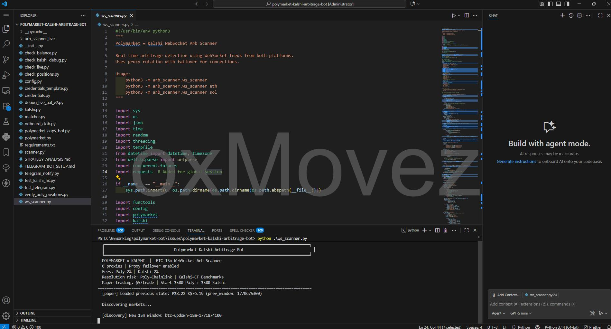
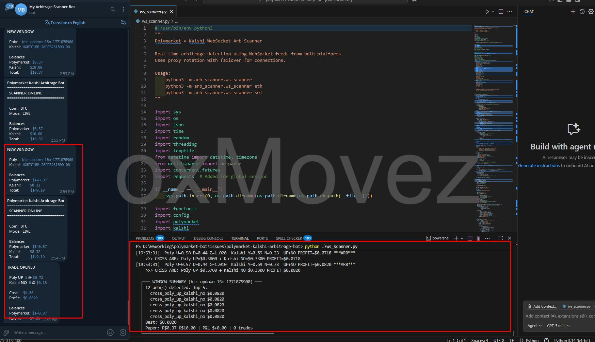
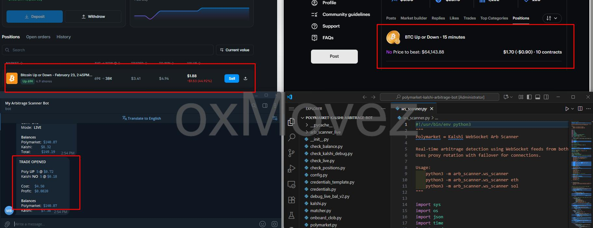

# Polymarket Kalshi 套利機器人 | 跨平台加密貨幣二元期權交易

> **語言：** [English](README.md) | [中文](#)

---

## 📬 聯繫方式

**Telegram：** [@movez_x](https://t.me/movez_x)

---

## 這是什麼機器人？

**Polymarket Kalshi 套利機器人** 是一款自動化交易機器人，專注於捕捉 **Polymarket** 與 **Kalshi** 兩大預測市場之間的 **無風險套利機會**。

### 策略簡述

兩個平台都提供 **15 分鐘加密貨幣二元期權**（BTC、ETH、SOL）。每個市場問的是：*「這 15 分鐘結束時，價格會漲還是跌？」* — 其中一方必定獲勝並支付 $1.00。

機器人會尋找 **兩邊合計成本低於 $1.00** 的時機。同時買入兩邊，無論市場往哪個方向走，都能鎖定 **guaranteed 利潤**。無需方向性判斷，純粹套利。

- **平台內套利：** 當 Polymarket 上 UP + DOWN 合計 < $1.00（扣除手續費後）時買入
- **跨平台套利：** 當 Polymarket UP + Kalshi NO（或 DOWN + YES）合計 < $1.00 時買入

即時 WebSocket 數據、2 次確認機制與嚴格利潤門檻，確保執行快速且穩定。

---

## 截圖

*真實交易記錄與實盤表現 — 親眼見證機器人運作。*

**Bot Running（機器人運行中）**



**Trade Log（交易記錄）**



**Order Fill（訂單成交）**



---

## 5 大交易者優勢

1. **被動收入潛力** — 在 VPS 上 24/7 運行，每秒掃描並在出現套利時自動交易。無需盯盤。

2. **低風險、保證獲利** — 其中一方必定獲勝。以低於 $1.00 買入兩邊，獲得 $1.00 回報。無方向性風險。

3. **真實交易記錄** — 上方截圖可見實際交易。所有交易記錄於 `arb_scanner_live/trade_log.json` 與 `arb_scanner_live/live_trades.json`。

4. **高頻機會** — 每天 96 個 15 分鐘窗口。機會越多，越能累積穩定小利潤。

5. **全自動、無情緒干擾** — 無 FOMO、無猜測。機器人嚴格遵循套利規則與利潤門檻。

### 進階功能：Telegram 機器人整合

機器人整合 **Telegram**，提供即時警報與遠端控制。交易開倉、部分成交、對沖結果、新窗口等即時通知 — 還可使用 `/status` 指令隨時查詢餘額與機器人狀態。

---

**想新增功能、尋求協助、取得進階版或取得完整原始碼？** 請透過 Telegram 聯繫：[@movez_x](https://t.me/movez_x)

---

## 快速開始

### 環境需求

- Python 3.8+
- Polymarket 帳戶（需有 USDC）
- Kalshi 帳戶（需有 USD）

### 安裝步驟

1. **克隆專案**
   ```bash
   git clone <repo-url>
   cd polymarket-kalshi-arbitrage-bot
   ```

2. **安裝依賴**
   ```bash
   pip install -r requirements.txt
   ```

3. **設定憑證**
   - 複製 `credentials_template.py` 為 `credentials.py`
   - 填入 Polymarket API 金鑰與 Kalshi API 金鑰

4. **啟動機器人**
   ```bash
   python ws_scanner.py
   ```
   交易 ETH 或 SOL：`python ws_scanner.py eth` 或 `python ws_scanner.py sol`

5. **查詢餘額**
   ```bash
   python check_balance.py
   ```

---

## 聯繫方式

**Telegram：** [@movez_x](https://t.me/movez_x)
